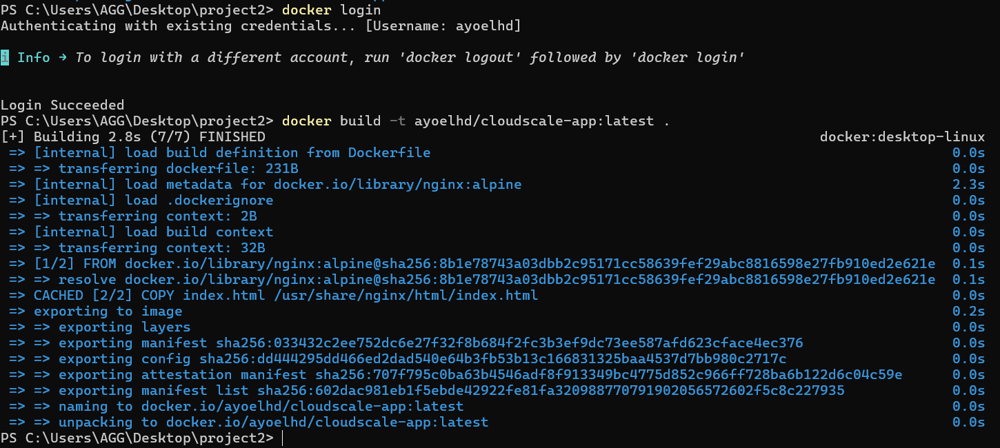
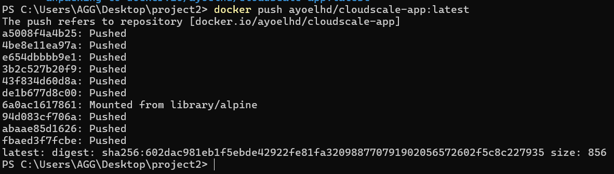
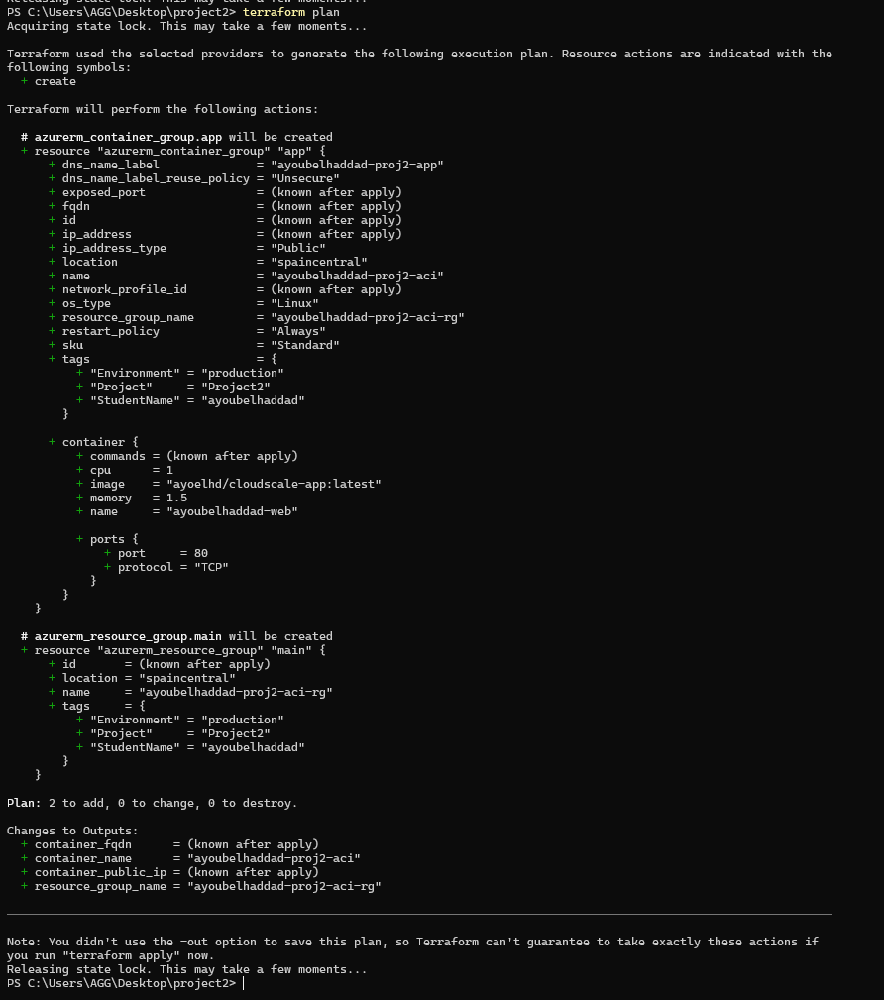
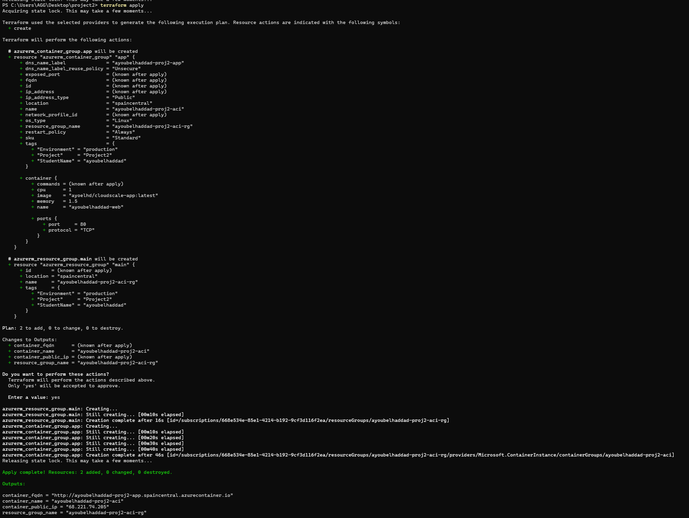
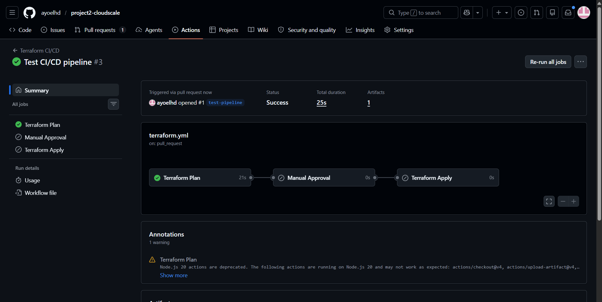
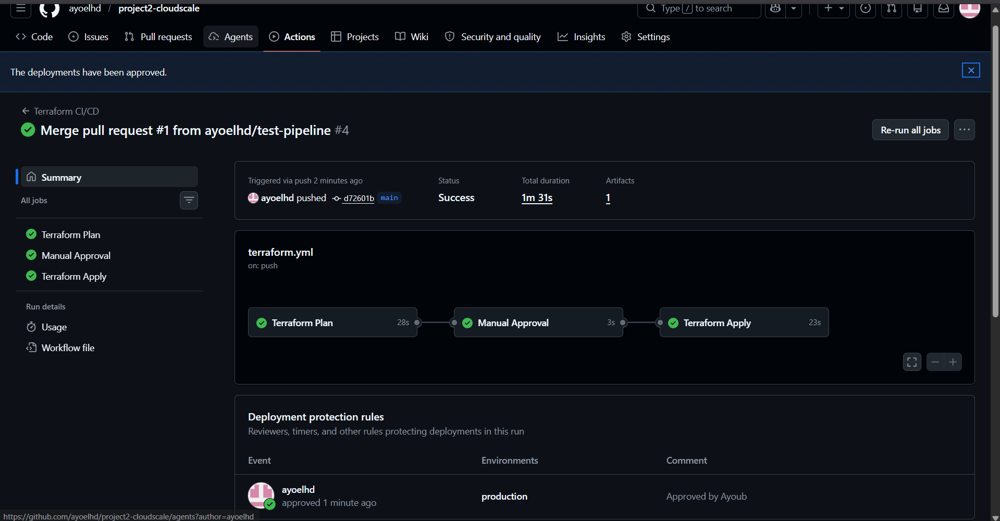
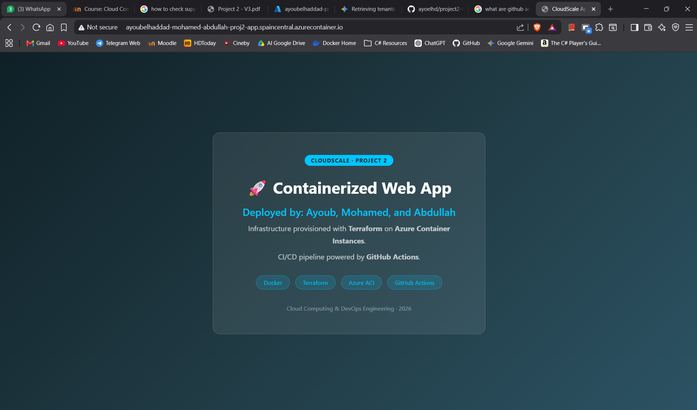
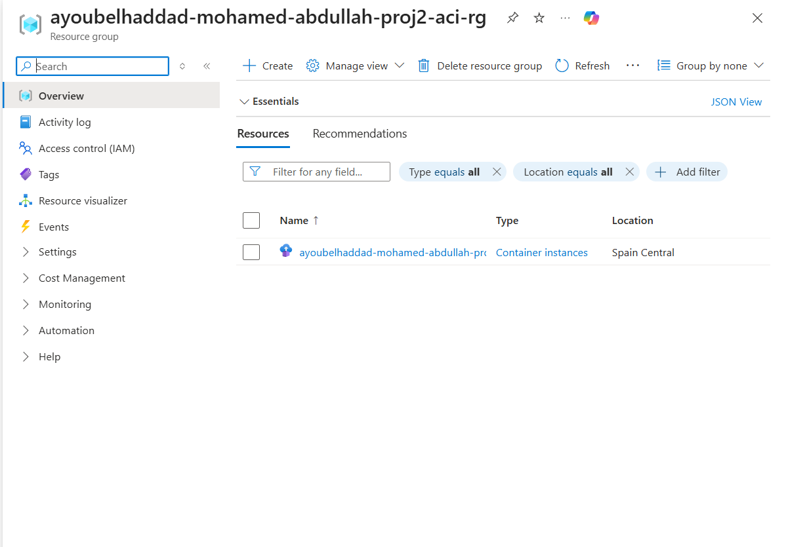

# Project 2 – Infrastructure as Code with Terraform & Azure ACI

## Authors

| Name | Student ID |
|------|-----------|
| [Ayoub Elhaddad] | [5179] |
| [Abdullah Fahmi] | [4827] |
| [Mohamed Aldarbag] | [4955] |

---

## Project Title & Description

**CloudScale Container Deployment**

A fully automated Infrastructure-as-Code pipeline that:
- Packages a web application into a Docker image and pushes it to Docker Hub
- Provisions Azure Container Instances using Terraform
- Automates plan/apply via GitHub Actions with a manual approval gate for production

---

## Architecture Diagram

```
┌─────────────────────────────────────────────────────────────────┐
│                        GitHub Repository                        │
│                                                                 │
│  ┌──────────┐   PR     ┌──────────────────────────────────┐    │
│  │  Dev     │─────────▶│   GitHub Actions Workflow        │    │
│  │  Branch  │          │                                  │    │
│  └──────────┘   Push   │  1. terraform plan  (on PR)      │    │
│  ┌──────────┐─────────▶│  2. Manual Approval Gate         │    │
│  │  main    │          │  3. terraform apply (on main)    │    │
│  └──────────┘          └──────────────┬─────────────────-─┘    │
└─────────────────────────────────────--|─────────────────────────┘
                                        │ ARM credentials
                          ┌─────────────▼──────────────────┐
                          │          Azure Cloud            │
                          │                                 │
                          │  ┌──────────────────────────┐  │
                          │  │  Resource Group           │  │
                          │  │  yourname-proj2-aci-rg   │  │
                          │  │                           │  │
                          │  │  ┌─────────────────────┐ │  │
                          │  │  │ Azure Container      │ │  │
                          │  │  │ Instance (ACI)       │ │  │
                          │  │  │                      │ │  │
                          │  │  │  nginx:alpine        │ │  │
                          │  │  │  ← Docker Hub image  │ │  │
                          │  │  │  Port 80  Public IP  │ │  │
                          │  │  └─────────────────────-┘ │  │
                          │  └──────────────────────────┘  │
                          └────────────────────────────────┘

Docker Hub:  ayoelhd/cloudscale-app:latest
             ↑ built & pushed manually (or via separate workflow)
```

---

## Docker – Build & Push Instructions

```bash
# 1. Build the image
docker build -t DOCKERHUB_USERNAME/cloudscale-app:latest .

# 2. Log in to Docker Hub
docker login

# 3. Push the image
docker push DOCKERHUB_USERNAME/cloudscale-app:latest

# 4. Test locally
docker run -p 8080:80 DOCKERHUB_USERNAME/cloudscale-app:latest
# open http://localhost:8080
```

---

## Terraform Setup Instructions

### Prerequisites
- [Terraform ≥ 1.5](https://developer.hashicorp.com/terraform/install)
- [Azure CLI](https://learn.microsoft.com/en-us/cli/azure/install-azure-cli)
- An Azure subscription

### One-time: Create remote backend storage

```bash
az login

# Create resource group for Terraform state
az group create --name tfstate-rg --location eastus

# Create storage account (name must be globally unique, lowercase)
az storage account create \
  --name tfstateyourname \
  --resource-group tfstate-rg \
  --sku Standard_LRS

# Create blob container
az storage container create \
  --name tfstate \
  --account-name tfstateyourname
```

### Update variables

Edit `variables.tf` and set:
- `student_name` → your name (lowercase, no spaces)
- `docker_image` → your Docker Hub image reference

Also update `providers.tf` backend block with your storage account name.

### Local run

```bash
terraform init
terraform plan
terraform apply
```

---

## GitHub Actions Workflow Explanation

| Job | Trigger | What it does |
|-----|---------|-------------|
| `terraform-plan` | Every PR to `main` | Runs `init`, `fmt -check`, `validate`, `plan` |
| `manual-approval` | Push to `main` | Pauses and waits for a reviewer to approve in GitHub UI |
| `terraform-apply` | After approval | Runs `terraform apply` using the saved plan artifact |

### GitHub Secrets Required

Add these under **Settings → Secrets → Actions**:

| Secret | Where to get it |
|--------|----------------|
| `ARM_CLIENT_ID` | Azure Service Principal |
| `ARM_CLIENT_SECRET` | Azure Service Principal |
| `ARM_SUBSCRIPTION_ID` | `az account show --query id` |
| `ARM_TENANT_ID` | `az account show --query tenantId` |

### Create Service Principal

```bash
az ad sp create-for-rbac \
  --name "project2-sp" \
  --role Contributor \
  --scopes /subscriptions/YOUR_SUBSCRIPTION_ID
```

Copy the output values into your GitHub Secrets.

### Enable Manual Approval

1. Go to **Settings → Environments → New environment** → name it `production`
2. Enable **Required reviewers** and add yourself (and teammates)

---

## Screenshots

> Replace each placeholder below with your actual screenshots.

### 1. Docker image build successful


### 2. Docker image pushed to Docker Hub


### 3. terraform plan output


### 4. terraform apply output


### 5. GitHub Actions – successful plan on PR


### 6. GitHub Actions – approved apply


### 7. Browser showing containerized web app


### 8. Azure Portal – resource group and resources


---

## Step-by-Step Detailed Solution

### Step 1 – Create the web app
- Write `index.html` with your name displayed
- Write `Dockerfile` based on `nginx:alpine`, copy HTML, expose port 80

### Step 2 – Build & push Docker image
- `docker build`, `docker login`, `docker push` (see commands above)

### Step 3 – Write Terraform code
- `providers.tf`: AzureRM provider + remote backend
- `variables.tf`: student_name, location, docker_image, cpu, memory
- `main.tf`: Resource Group + Container Instance with public IP & DNS label
- `outputs.tf`: resource group name, public IP, FQDN, container name

### Step 4 – Set up remote backend
- Create Azure Storage Account + blob container for state (see setup above)

### Step 5 – Run Terraform locally
- `terraform init` → `terraform plan` → review → `terraform apply`
- Verify app loads at the output FQDN

### Step 6 – Set up GitHub repository
- Push all files; ensure `.gitignore` excludes state files
- Add all 4 ARM secrets under repo Settings
- Create `production` environment with required reviewer

### Step 7 – Test GitHub Actions
- Open a PR → confirm `terraform-plan` job runs and posts the plan
- Merge PR → confirm workflow pauses at approval gate
- Approve → confirm `terraform-apply` runs and succeeds

### Step 8 – Take screenshots
- Screenshot each numbered item in Section 4.2 of the handout

---

## Repository Link

https://github.com/ayoelhd/project2-cloudscale
